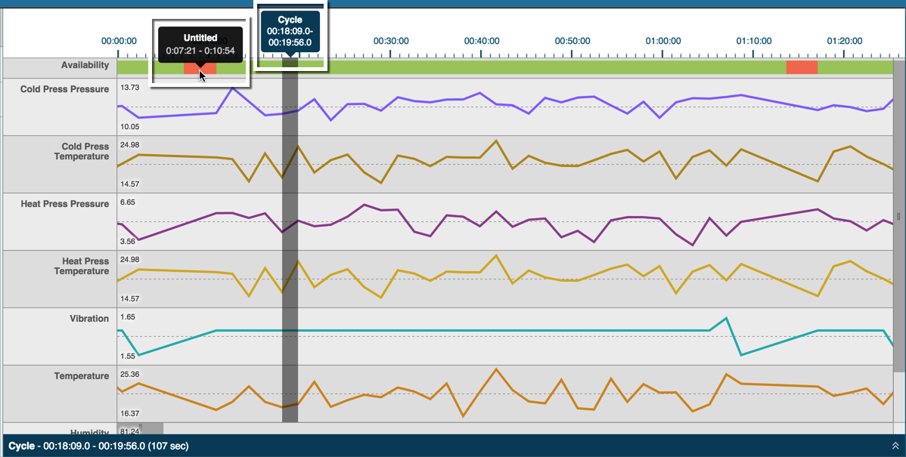

# Viewing Cycle Timeline

The cycle timeline displays in the top pane of the Timeline Tab. 
 

* Click on the Availability row \(top\) to display a gray-shaded, vertical bar that shows the selected time range. The cycle time range displays in pop-up text above the row and at the lower left of the cycle pane.
  * Downtime appears as red-shaded sections in the Availability row. Hovering over downtime displays pop-up text with the beginning and ending downtime range.
  * A row for each machine measure displays under the Availability row. Each row is labeled by measure \(i.e. Cold Press Pressure, Temperature, etc.\). A corresponding line graph for the measure appears for each row to the right, color coded and for a 24-hour period.
  * At the beginning of each line graph, numeric high and low values display for each measure.
  * Scroll up and down to see all measures, or left to right to see the entire 24-hour line graph.

* Hover over any red sections of the Availability row to display pop-up text displaying the actual availability. 

